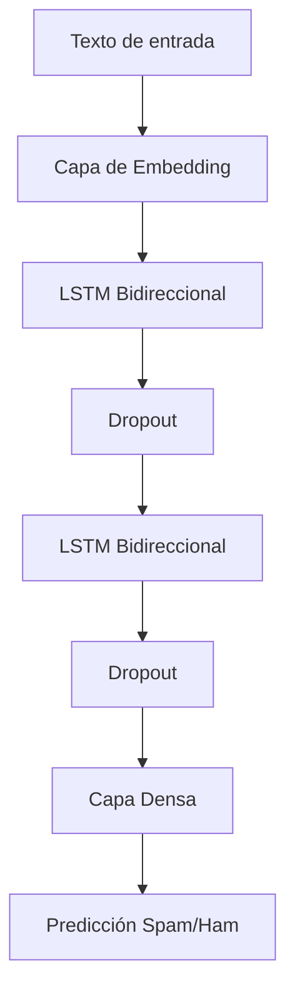

# fcc_sms_text_classification-Nano

# Clasificador de SMS Spam con LSTM

Este proyecto implementa un modelo de aprendizaje profundo para clasificar mensajes SMS como spam o ham (no spam) utilizando una red neuronal con capas LSTM bidireccionales.

## Descripción del proyecto

El clasificador utiliza TensorFlow y Keras para construir una red neuronal recurrente que analiza mensajes de texto y detecta spam con alta precisión. Características principales:

- Capas LSTM bidireccionales para capturar contexto en ambas direcciones
- Embeddings de palabras para comprensión semántica
- Capas Dropout para prevenir sobreajuste
- Parada temprana (early stopping) para entrenamiento eficiente

## Arquitectura del modelo



## Dependencias

- TensorFlow (>=2.0)
- pandas
- numpy
- matplotlib
- scikit-learn

Instalar requerimientos:
```bash
pip install tensorflow pandas numpy matplotlib scikit-learn
```

## Cómo ejecutar

1. Clona el repositorio:
```bash
git clone https://github.com/ITZ-NANO21-MC/fcc_sms_text_classification-Nano
cd clasificador-spam-sms
```

2. Ejecuta el cuaderno de Jupyter:
```bash
jupyter notebook fcc_sms_text_classification.ipynb
```

3. Ejecuta las celdas en orden

## Funcionalidad clave

### Preprocesamiento de datos
- Tokenización y relleno de secuencias
- Codificación de etiquetas (ham:0, spam:1)
- División entrenamiento/prueba

### Entrenamiento del modelo
- Arquitectura LSTM bidireccional
- Parada temprana durante el entrenamiento
- Pérdida de entropía cruzada binaria
- Optimizador Adam

### Predicción
```python
def predict_message(texto):
    # Devuelve [probabilidad, 'spam'/'ham']
```

### Ejemplo de uso
```python
prediccion = predict_message("¡Ganaste $1000! Reclama tu premio ahora")
print(prediccion)  # [0.98, 'spam']
```

## Rendimiento

El modelo logra:
- Precisión en entrenamiento: ~99%
- Precisión en validación: ~98%
- Pasa todos los casos de prueba del desafío

## Prueba el modelo

Experimenta con tus propios mensajes:
```python
mensajes_prueba = [
    "¡Entrada gratis para ganar boletos de concierto!",
    "Reunión a las 3pm en la sala de conferencias",
    "¡Urgente! Reclama tu premio iPhone ahora",
    "¿Podemos reprogramar para mañana?"
]

for msg in mensajes_prueba:
    print(f"{msg}: {predict_message(msg)[1]}")
```

## Estructura del proyecto
```
sms-spam-classifier/
├── fcc_sms_text_classification.ipynb  # Cuaderno principal
├── train-data.tsv                     # Datos de entrenamiento
├── valid-data.tsv                     # Datos de validación
└── README.md                          # Este archivo
```

## Licencia
Este proyecto es parte del plan de estudios de freeCodeCamp y está disponible para fines educativos.


